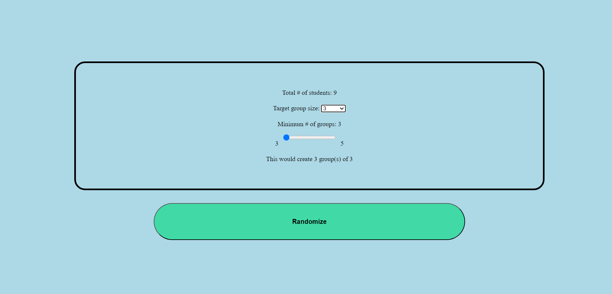
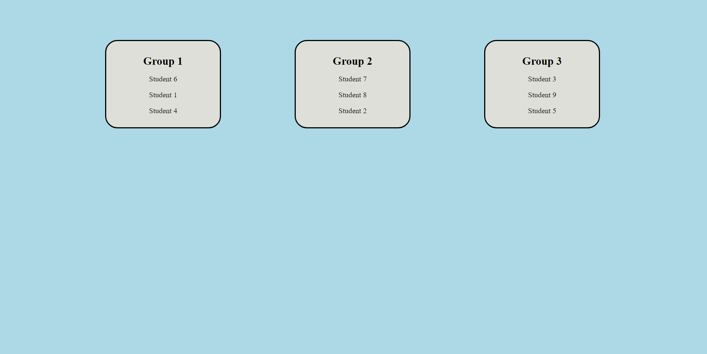

# RandomizerApp 

## Table of Contents
* [Description](#description)
* [Installation](#installation)
* [Usage](#usage)
* [License](#license)
* [Questions](#questions)

## Description
This application allows the user to create randomized groups within specific parameters. Given an array of students and a target group size, the application will generate the randomized groups. The size of each group will either be the target size provided, or 1 less than the target group size.  

## Installation
Clone the repository to your device to utilize it.

## Usage
Edit the studentsArray with your data and open the application in your browser. Once your options are set, click the 'Randomize' button to randomize your groups. Then, click on each card to reveal the group.

## License
This project is licensed with MIT.

## Questions
Follow me on [Github](https://github.com/kayvonk).

To contact me, send an email to kayvonk@gmail.com with your name and inquiry.